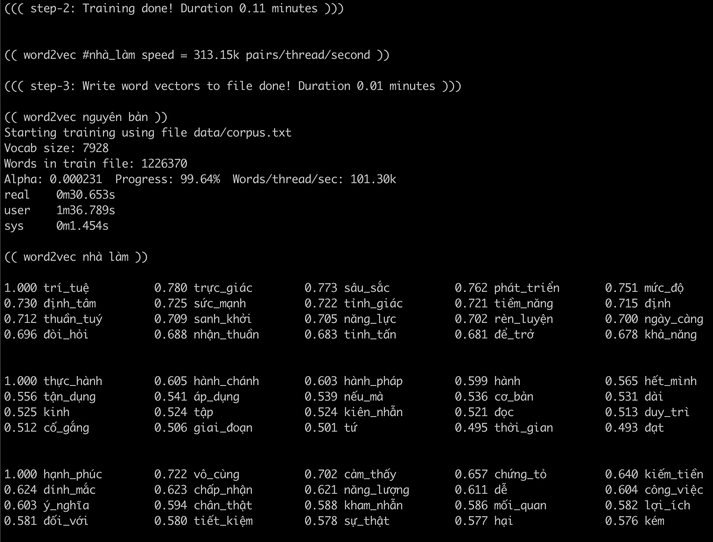
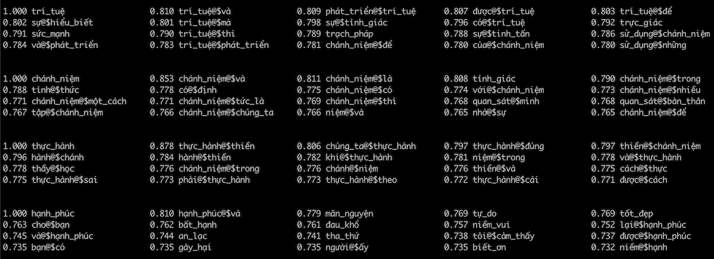

## Big pic

Kết quả hiện ở vùng `small models` (`retrofit` chưa khám phá, glove bỏ qua vì sgns là đủ tốt, fasttext bỏ qua vì tiếng Việt ko cần sub-word embedding). Vùng `large models` sẽ dần khám phá dùng với [`nnlm`](https://github.com/telexyz/nnlm) (mô hình ngôn ngữ sử dụng mạng nơ-ron)

## TODOs

* Cài đặt lại `josh` bằng Zig

* Đọc hiểu `docs/josh.md`

* Làm hierarchical topic modeling (`docs/_5-text_mining.md`)

* Nghịch `retrofit` với tiếng Việt?

* Optimize nhân ma trận, vector với `openblas`. Cài đặt đúng theo nguyên bản `hogbatch`?

#### [ >> DOING << ]

* Cài đặt lại `binarize` bằng Zig

* Triển khai bản `binarize` lên web assembly để demo
  sau khi `binarize` 256 x f32 vector giờ còn 256-bits và chỉ dùng các phép toán 
  trên bit như AND, OR, XOR nên tốc độ decode cực nhanh

#### [ DONE ]

* Tăng tốc nhân ma trận `negative_matrix` với `hidden_vector` bằng SIMD

* Tăng tốc so sánh vectors bằng `binarize`
  `brew install openblas && cd xxx2vec/binarize && make`

* Bổ xung `uni_bi, bi_uni, bi_bi` vào training pairs (tham khảo `ngram2vec`)

* Thử `josh` trên tiếng Việt

* Tăng tốc SGNS bằng HogBatch parallel SGD (tham khảo `pword2vec.cpp`)
  ( minibatching and negative sample sharing )

* Cài đặt SGNS bằng Zig
  - Đầu vào `data/vocab.txt`, `data/inputs_outputs.txt`
  - Đầu ra  `data.vocab.vec`

* Hoàn thiện `src/sampling.zig` theo nguyên bản `word2vec` (`uni_uni`)

* Dùng từ điển và `word2phrase.c` để nhóm 2 âm tiết thành một từ

* Trích xuất phần convert `syllable_id` sang utf-8 từ `engine` repo

* Tìm hiểu tất tần tật về xxx2vec

* Đọc hiểu ngram2vec
  https://aclanthology.org/D17-1023.pdf

* Đọc hiểu SGNS (skip-gram negative sampling)
  http://mccormickml.com/2016/04/19/word2vec-tutorial-the-skip-gram-model

* Tìm hiểu về `word2phrase.c`
  https://github.com/chrisjmccormick/word2vec_commented/blob/master/word2phrase.c
  Each run of the word2phrase tool looks at combinations of two words (or tokens), 
  so the first pass would turn "New York" into "New_York" and 
  the second pass would turn "New_York City" into "New_York_City".

* Thêm comments vào `word2vec.c` để hiểu về cách cài đặt thuật toán
  https://github.com/chrisjmccormick/word2vec_commented/blob/master/word2vec.c

- - -

## Thành quả bước đầu

1/ Dùng từ điển nhóm cặp âm tiết thành một từ. Cài đặt thuật toán`word2phrase` để cover những term đặc trưng của từng corpus (phát hiện được gần 1k term mới cho 6mb text đầu vào).

Input:  `dễ gì mà chấp nhận được cuộc sống là luôn biến động và không thể kiểm soát`
Output: `dễ gì mà chấp_nhận được cuộc_sống là luôn biến_động và không_thể kiểm_soát`

Tại sao chỉ nhóm các từ 2 âm tiết? Vì:
- số lượng từ = 2 âm tiết chiếm khoảng 85% từ điển nên đây chính là trọng tâm cần tập trung làm tốt
- các từ >= 3 âm tiết sẽ được cover trong `bigram` khi làm `ngram2vec`

=> Thuật toán tuy đơn giản nhưng mang lại hiệu quả cao!

2/ Cài đặt thuật toán skip-gram negative samping bằng Zig

!!! Kết quả ổn + tốc độ huấn luyện nhanh `gấp 10 lần` bản gốc !!!

__Note__: word2vec show tốc độ là `Words/thread/sec: 101.26k` nhưng thực tế chỉ có `~30k` (`1226370 words * 10 pairs / (60.0 + 36) / 4 threads`)

- - -

Kết quả thử nghiệm `ngram2vec` chưa thuyết phục
=> cần lọc stopwords `và, mà, thì, để ...` để giảm nhiễu

