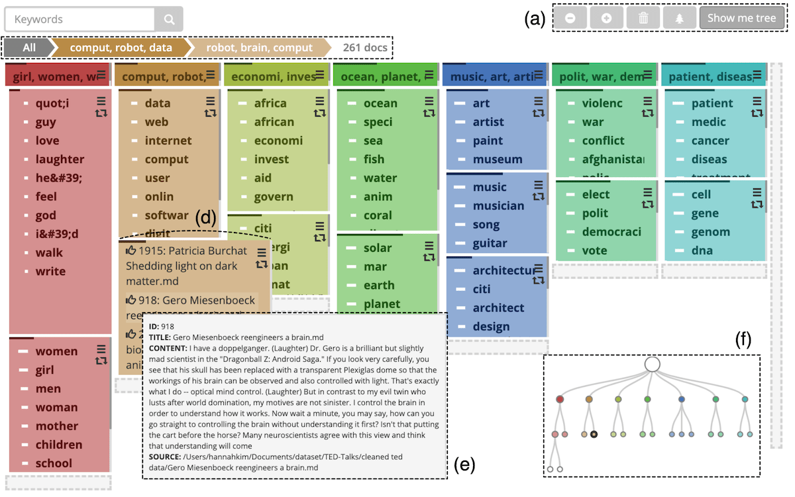
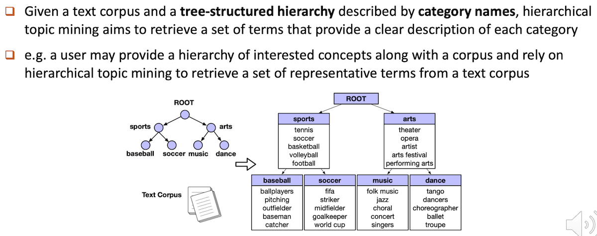
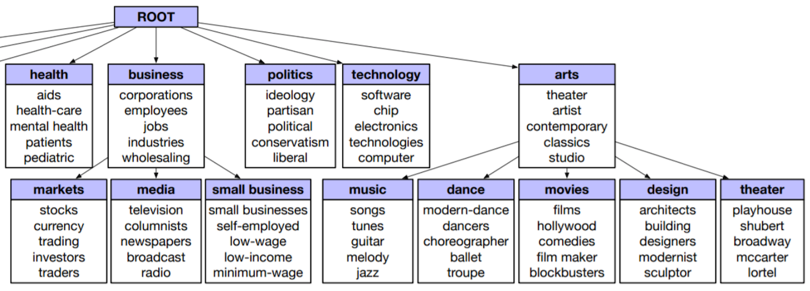

https://towardsdatascience.com/how-to-perform-topic-modeling-with-top2vec-1ae9bb4e89dc

https://faculty.cc.gatech.edu/~aendert3/resources/Kim2020ArchiText.pdf

{width=800 height=500}

## module 5a/ Tìm topics cho từng đoạn của 150 bài pháp

### INPUT:
  - Khoảng 7500 đoạn văn bản ngắn
  - Init categories dưới dạng cây mà người dùng quan tâm

### OUPUT:
  - Phát hiện thêm các topics (representative terms) để làm rõ hơn nội dung của các init categories

### REPEAT: 
  - Dựa vào kết quả trên, điều chỉnh init categories và lại bắt đầu lại để đạt được cây categories người dùng thấy ưng.

_NOTE_: Phần này ko cần `language model`, không cần `syllables2words`
mà cần `word2phrase`, `word2vec` ... Cụ thể như sau:

* Loại bỏ stopwords (dùng `stopword dict` và `sub-sampling`)
* Nhóm âm tiết thành từ (`word2phrase`)
* Nhúng `uni_bi, bi_bi, bi_uni pairs` vào không gian vectors
* Căn chỉnh vectors sao cho có độ tương đồng về khoảng cách với các terms của cây categories
* Clustering để tìm ra thêm các topics (representative terms)

## Hierarchical Topic Mining via Joint Spherical Tree and Text Embedding

- https://github.com/yumeng5/JoSH
- https://yumeng5.github.io/files/JoSH.pdf
- https://arxiv.org/pdf/2007.09536.pdf

### Xem video https://www.youtube.com/watch?v=AIvtHkPiIpo

{width=800 height=315}

{width=800 height=289}