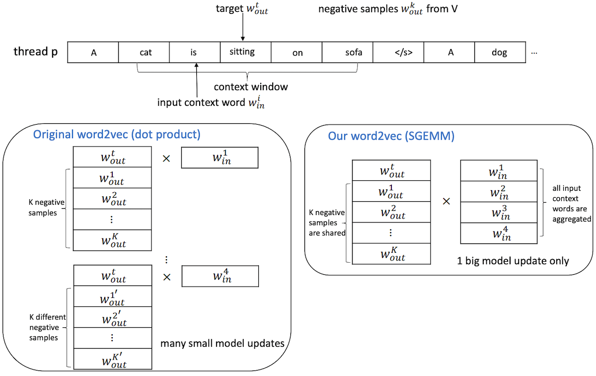
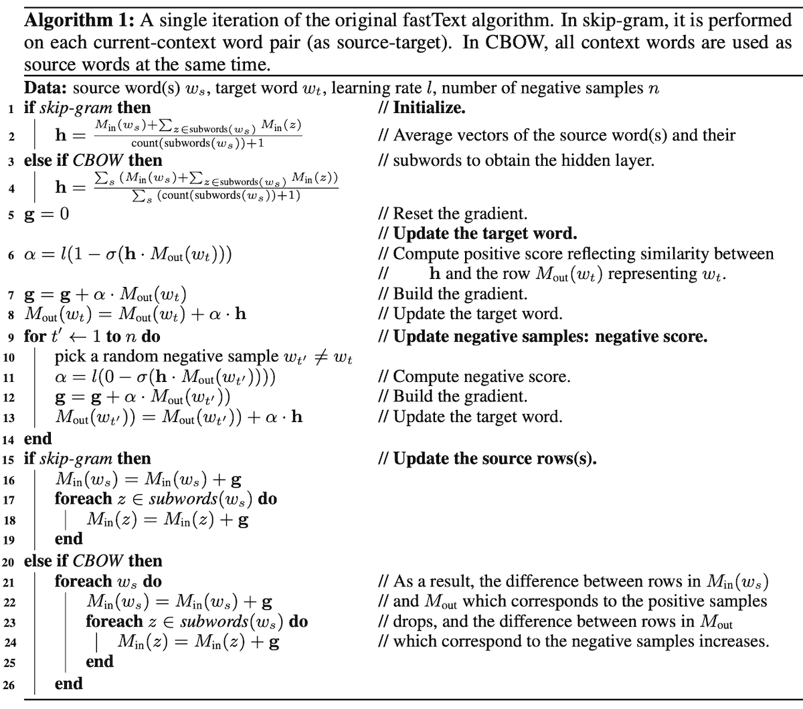

## pword2vec

https://github.com/IntelLabs/pWord2Vec

https://arxiv.org/pdf/1611.06172.pdf

### HogBatch

{width=800 height=505}


```c
  int num_batches = num_inputs / batch_size + ((num_inputs % batch_size > 0) ? 1 : 0);

  // start mini-batches
  for (int b = 0; b < num_batches; b++) {

      // generate negative samples for output layer
      int offset = 1;
      for (int k = 0; k < negative; k++) {
          next_random = next_random * (ulonglong) 25214903917 + 11;
          int sample = table[(next_random >> 16) % table_size];
          if (!sample)
              sample = next_random % (vocab_size - 1) + 1;
          int* p = find(outputs.indices, outputs.indices + offset, sample);
          if (p == outputs.indices + offset) {
              outputs.indices[offset] = sample;
              outputs.meta[offset] = 1;
              offset++;
          } else {
              int idx = p - outputs.indices;
              outputs.meta[idx]++;
          }
      }
      outputs.meta[0] = 1;
      outputs.length = offset;

      // fetch input sub model
      int input_start = b * batch_size;
      int input_size  = min(batch_size, num_inputs - input_start);
      for (int i = 0; i < input_size; i++) {
          memcpy(inputM + i * hidden_size, Wih + inputs[input_start + i] * hidden_size, hidden_size * sizeof(real));
      }
      // fetch output sub model
      int output_size = outputs.length;
      for (int i = 0; i < output_size; i++) {
          memcpy(outputM + i * hidden_size, Woh + outputs.indices[i] * hidden_size, hidden_size * sizeof(real));
      }

#ifndef USE_MKL
      for (int i = 0; i < output_size; i++) {
          int c = outputs.meta[i];
          for (int j = 0; j < input_size; j++) {
              real f = 0.f, g;
              #pragma simd
              for (int k = 0; k < hidden_size; k++) {
                  f += outputM[i * hidden_size + k] * inputM[j * hidden_size + k];
              }
              int label = (i ? 0 : 1);
              if (f > MAX_EXP)
                  g = (label - 1) * alpha;
              else if (f < -MAX_EXP)
                  g = label * alpha;
              else
                  g = (label - expTable[(int) ((f + MAX_EXP) * EXP_RESOLUTION)]) * alpha;
              corrM[i * input_size + j] = g * c;
          }
      }
#else
      cblas_sgemm(CblasRowMajor, CblasNoTrans, CblasTrans, output_size, input_size, hidden_size, 1.0f, outputM,
              hidden_size, inputM, hidden_size, 0.0f, corrM, input_size);
      for (int i = 0; i < output_size; i++) {
          int c = outputs.meta[i];
          int offset = i * input_size;
          #pragma simd
          for (int j = 0; j < input_size; j++) {
              real f = corrM[offset + j];
              int label = (i ? 0 : 1);
              if (f > MAX_EXP)
                  f = (label - 1) * alpha;
              else if (f < -MAX_EXP)
                  f = label * alpha;
              else
                  f = (label - expTable[(int) ((f + MAX_EXP) * EXP_RESOLUTION)]) * alpha;
              corrM[offset + j] = f * c;
          }
      }
#endif


#ifndef USE_MKL
      for (int i = 0; i < output_size; i++) {
          for (int j = 0; j < hidden_size; j++) {
              real f = 0.f;
              #pragma simd
              for (int k = 0; k < input_size; k++) {
                  f += corrM[i * input_size + k] * inputM[k * hidden_size + j];
              }
              outputMd[i * hidden_size + j] = f;
          }
      }
#else
      cblas_sgemm(CblasRowMajor, CblasNoTrans, CblasNoTrans, output_size, hidden_size, input_size, 1.0f, corrM,
              input_size, inputM, hidden_size, 0.0f, outputMd, hidden_size);
#endif


#ifndef USE_MKL
      for (int i = 0; i < input_size; i++) {
          for (int j = 0; j < hidden_size; j++) {
              real f = 0.f;
              #pragma simd
              for (int k = 0; k < output_size; k++) {
                  f += corrM[k * input_size + i] * outputM[k * hidden_size + j];
              }
              inputM[i * hidden_size + j] = f;
          }
      }
#else
      cblas_sgemm(CblasRowMajor, CblasTrans, CblasNoTrans, input_size, hidden_size, output_size, 1.0f, corrM,
              input_size, outputM, hidden_size, 0.0f, inputM, hidden_size);
#endif

      // subnet update
      for (int i = 0; i < input_size; i++) {
          int src = i * hidden_size;
          int des = inputs[input_start + i] * hidden_size;
          #pragma simd
          for (int j = 0; j < hidden_size; j++) {
              Wih[des + j] += inputM[src + j];
          }
      }

      for (int i = 0; i < output_size; i++) {
          int src = i * hidden_size;
          int des = outputs.indices[i] * hidden_size;
          #pragma simd
          for (int j = 0; j < hidden_size; j++) {
              Woh[des + j] += outputMd[src + j];
          }
      }

  }
```

- - -

https://openreview.net/references/pdf?id=oqtIL8DEZ

https://github.com/FT-Submit/ft-mod

FastText has been implemented as a part of the popular Gensim library (Rehurek
& Sojka, 2011) using Cython and a default machine’s BLAS library (e.g., Intel MKL) for algebraic
operations. In our experiments we found the code memory-expensive and slow: training 5 epochs on
a 1 GB English Wikipedia dump with 24 threads took approximately 11 hours on a Knights Landing
CPU, about 10 times slower than the original fastText. Therefore, we use the original code provided
by Facebook Research (2016a) as the baseline in all our experiments.

For skip-gram with negative sampling, pWord2Vec (Ji et al., 2016) transforms the “Hogwild” approach into “Hogbatch”, by performing updates on multiple context words at once (effectively turning a series of dot products into a matrix-matrix operation) and sharing negative samples for the
entire batch. We employ similar techniques in our implementation.

The work by Rengasamy et al. (2017) extends this approach by context combining, where multiple
contexts can share a set of negative samples and be updated all at once. We do not adapt this approach as it requires careful preprocessing rewarded by a relatively small speedup over pWord2Vec


{width=800 height=706}

line 7,8/12,13 là tốn compu nhất, rồi tới 6/11, rồi tới 16.

To improve the training time, we first identify the most expensive operations. Assume that the source word(s) have a total of m subwords and that we use n negative samples per target word. Then each update comprises:

• Construction of h: a sum of m vectors (line 2 or 4).
• Loss calculation: n + 1 dot products and 2(n + 1) vector additions (lines 6–8, 11–13). 
• Gradient update: m vector additions (lines 16–19 or 21–26).

## Results


METHOD       ONE-THREAD SPEED-UP

SG_code_opt  3.7x

SG_batch     4.4x


### Code performance optimizations (code opt). 

For efficient execution we explicitly vectorize ma- trix and vector operations using AVX-512 intrinsics. We block and merge operations involving mul- tiple reads from the same location in memory to make them more cache-friendly (temporal locality), like averaging the rows of Min or subsequently reading from and writing to Mout.

To speed up the binary logistic loss function, we vectorize the dot product (lines 6, 11) with the use of eight accumulators to increase instruction-level parallelism without too much register pressure. We merge the update of the gradient g and the relevant rows of Mout (lines 7–8, 12–13) to avoid multiple reads from the latter. We still call the loss function once per each wt and w′t.


Similar to the creation of h, we improve the update of Min(ws) with g (line 16 or 21–22) by reading each element of g only once for all words and subwords ws.

The optimizations in the version code opt are used in all algorithmic variants discussed next. Note that these optimizations can also be applied to other regularization schemes such as the hierarchical softmax used in the original word2vec (Mikolov et al., 2013).


### Minibatching (batch for SG).

For skip-gram, we implement a form of minibatching of the target
words per each source word. Rather than following the work of Ji et al. (2016), which merges all
Min(ws) rows in a minibatch into a matrix, we follow the original fastText’s approach hitherto only
applied to CBOW, which simply averages all these rows. The advantage of our minibatching over the
original fastText skip-gram is being able to execute a single update for each context window of the
current word wi, rather than per each current-context word pair. This means that h and the relevant
rows of the input matrix Min are updated only once per each current word, independent of context
window size. Lines 2 and 16 are now executed only once per context window, in a similar fashion
as in lines 4 and 21–22 respectively). This creates an additional delay between reading and writing
a word’s subword representations increasing the possibility of write conflicts, but our experiments
later show that the accuracy remains nearly unaffected. Minibatching can bring significant speed
improvements to subword-based training due to the relatively high cost of building h and updating
all subword representations. As mentioned, in fastText CBOW, this form of batching is already a
part of its algorithmic structure.


- - -


## Online Interpretable Word Embeddings

https://www.emnlp2015.org/proceedings/EMNLP/pdf/EMNLP196.pdf

https://github.com/luohongyin/OIWE


1/ employ adaptive gradient descent to speedup learning convergence.

2/ design projected gradient descent (Lin, 2007) for optimization 

`word2nvec.c` phần code cho 1/ và 2/ có vẻ adhoc, k thú vị => Bỏ qua!
