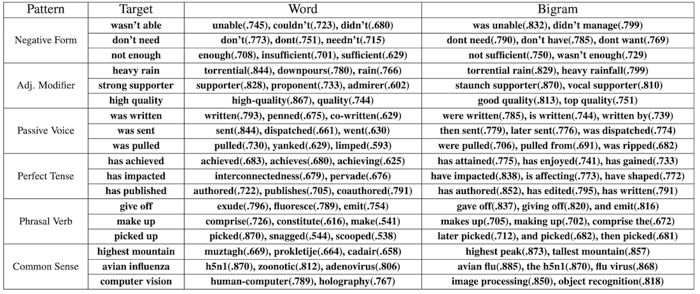
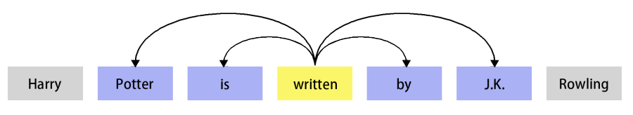
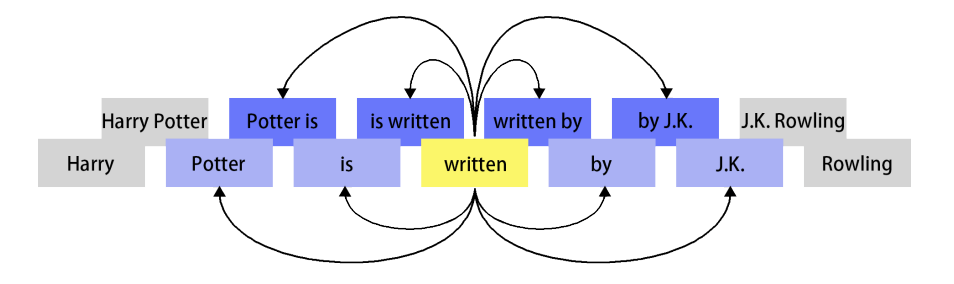
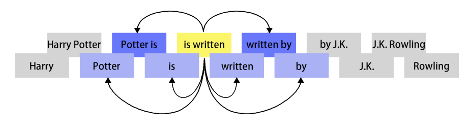
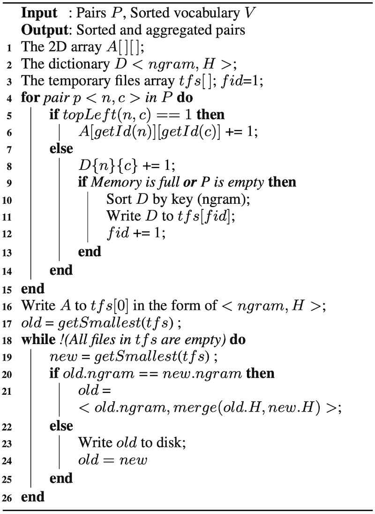

# Ngram2Vec

https://aclanthology.org/D17-1023.pdf


{width=800 height=337}

The results show that `improved word representations` are learned from `ngram cooccurrence statistics`.

Besides, a novel approach of building co-occurrence matrix is proposed to alleviate the hardware burdens brought by ngrams.


## SGNG

1/ Scan the corpus and use `<word, context>` pairs in the local window as training samples. 
2/ Train the models to make words useful for predicting contexts (or in reverse).

SGNS speeds up the training process, reducing the training time from days or weeks to hours. Also, the trained embeddings possess attractive properties. They are able to reflect relations between two words accurately, which is evaluated by a fancy task called word analogy.

Due to the above advantages, many models are proposed on the basis of SGNS. For example:

* Faruqui et al. (2015) introduce knowledge in lexical resources into the models.
* Zhao et al. (2016) extend the contexts from the local window to the entire documents.
* Li et al. (2015) use supervised information to guide the training.
* Dependency parse-tree is used for defining context in (Levy and Goldberg, 2014a).
* LSTM is used for modeling context in (Melamud et al., 2016).
* Sub-word information is considered in (Sun et al., 2016; Soricut and Och, 2015).

{width=450 height=82}

{width=477 height=142}

{width=462 height=130}


## Ngrams on SGNS

Compared with its challengers, SGNS has more robust performance with faster training speed. The introduction of bigrams provides significant improvements at different hyperparameter settings. The SGNS of ‘bi bi’ type provides the highest results (`~10% improvements`)


## Co-occurrence matrix
```
window = 5
uni_uni 0.91B
uni_bi  2.79B
uni_tri 3.81B
bi_bi   7.97B
```
Number-of-Pairs from wiki2010

To speed up the process of building ngram co-occurrence matrix, we take advantages of
1/ ‘mixture’ strategy (Pennington et al., 2014) and
2/ ‘stripes’ strategy (Dyer et al., 2008; Lin, 2008).

The two strategies optimize the process in different aspects. Computational cost is reduced significantly when they are used together.

When words (or ngrams) are sorted in descending order by frequency, the co-occurrence matrix’s
top-left corner is dense while the rest part is sparse. Based on this observation, the ‘mixture’ of two data structures are used for storing matrix:

* Elements in the top-left corner are stored in a 2D array, which stays in memory. 

* The rest of the elements are stored in the form of `<ngram, H>`, where `H<context, count>` is an associative array recording the number of times the ngram and context co-occurs (‘stripes’ strategy). 

{width=400 height=547}

Algorithm 1 above shows the way of using the ‘mixture’ and ‘stripes’ strategies together. In the first stage, pairs are stored in different data structures according to `topLeft` function. Intermediate results are written to temporary files when memory is full. In the second stage, we merge these sorted temporary files to generate co-occurrence matrix. The `getSmallest` function takes out the pair `<ngram, H>` with the smallest key from temporary files.

In practice, algorithm 1 is efficient. Instead of using computer clusters (Lin, 2008), we can build the matrix of ‘bi bi’ type even in a laptop. It only requires 12GB to store temporary files (win=2, sub-sampling=0, memory size=4GB), which is much smaller than the implementations in (Pennington et al., 2014; Levy et al., 2015) . More detailed analysis about these strategies can be found in the ngram2vec toolkit.