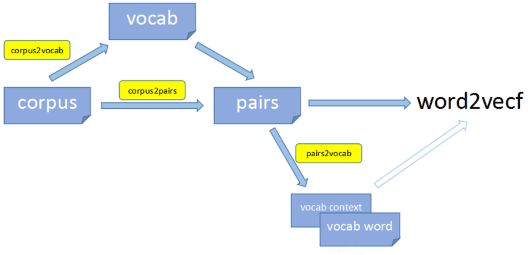

## Nice readings

https://leimao.github.io/article/Word2Vec-Classic

https://aegis4048.github.io/demystifying_neural_network_in_skip_gram_language_modeling

https://lilianweng.github.io/lil-log/2017/10/15/learning-word-embedding.html#noise-contrastive-estimation-nce

https://web.stanford.edu/class/archive/cs/cs224n/cs224n.1194/slides/cs224n-2019-lecture02-wordvecs2.pdf

## ngram2vec toolkit

{width=600 height=300}

Đóng góp khác biệt của ngram2vec so với bản gốc word2vec là nó liệt kê ra training pairs trước rồi mới train network thay vì đọc thẳng mọi pair từ corpus. Điều này giúp tính toán và lựa chọn tối ưu số lượng training pairs để tăng tốc training.

1/ lọc vocab từ corpus
corpus -> [ corpus2vocab ] -> `data/vocab`

Mỗi từ trong `vocab` được liệt kê cùng với số lần xuất hiện (count) của nó trong corpus

2/ liệt kê và chọn lọc training pair từ corpus
corpus -> [ corpus2pairs ] -> `data/pairs`

Mỗi `pair` là 1 cặp `input word, output word`
Một `pair` có thể lặp lại trong training data

3/ pairs -> [ pairs2vocab ] -> `data/vocab.input`, `data/vocab.output`

Mỗi từ trong `vocab.input` được liệt kê cùng với số lần xuất hiện (count) của nó trong input của một pair

Mỗi từ trong `vocab.output` được liệt kê cùng với số lần xuất hiện (count) của nó trong output của một pair

4/ pairs, vocab.input, vocab.output -> [ word2vec ] -> model

Như vậy bước 2/ là đóng góp riêng biệt nhất của ngram2vec.

### Kết luận

Thay vì subsampling vocab ta có thể subsampling pairs bằng cách liệt kê count của từng pair trước rồi mới lọc bớt sau!

- - -

Thống kê 1Gb combined.txt thấy có khoảng 2.6m bigrams.

=> Với corpus lớn thì cần dùng `u24` để định danh toàn bộ unigrams và bigrams.