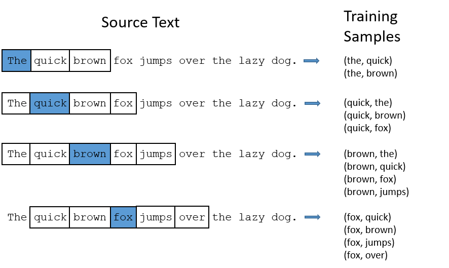
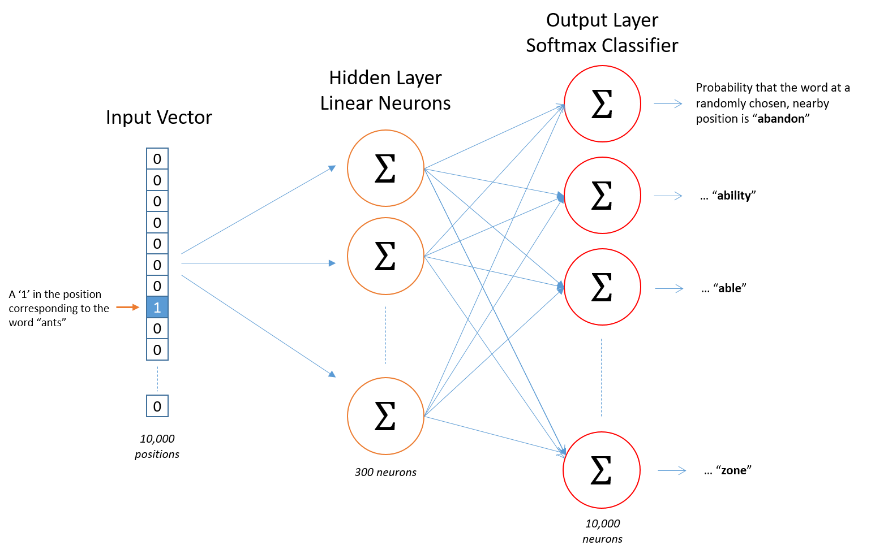
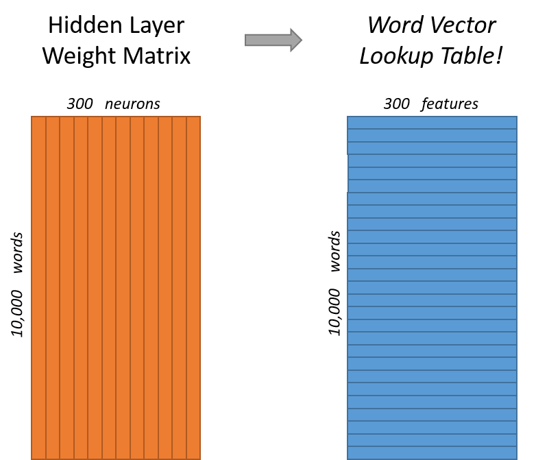
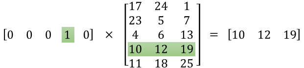
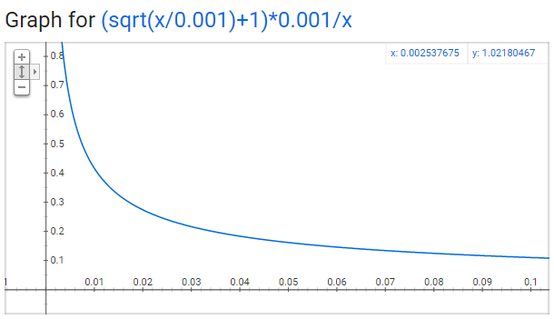

# Word2Vec

http://mccormickml.com/2016/04/19/word2vec-tutorial-the-skip-gram-model

## Skip-Gram

Exampld of skip gram training samples with `window = 2`

{width=700 height=400}
The network is going to learn the statistics from the number of times each pairing shows up. So, for example, the network is probably going to get many more training samples of (“Soviet”, “Union”) than it is of (“Soviet”, “Sasquatch”). When the training is finished, if you give it the word “Soviet” as input, then it will output a much higher probability for “Union” or “Russia” than it will for “Sasquatch”.

## Neural Network Architect

{width=800 height=500} 
### The Hidden Layer

For our example, we’re going to say that we’re learning word vectors with 300 features. So the hidden layer is going to be represented by a weight matrix with 10,000 rows (one for every word in our vocabulary) and 300 columns (one for every hidden neuron).

The number of features is a "hyper parameter" to "tune" to your application (try different values and see what yields the best results).

If you look at the rows of this weight matrix, these are actually what will be our word vectors!

{width=400 height=360}

### The Output Layer

The `1 x 300` word vector for “ants” then gets fed to the output layer. The output layer is a softmax regression classifier. There’s an in-depth tutorial on Softmax Regression here, but the gist of it is that each output neuron (one per word in our vocabulary!) will produce an output between 0 and 1, and the sum of all these output values will add up to 1.

{width=600 height=150}

## Negative Sampling

http://mccormickml.com/2017/01/11/word2vec-tutorial-part-2-negative-sampling

We have word vectors with `300 components`, a vocabulary of `10,000 words`, and a neural network had two weight matrices: a hidden layer and output layer. Both of these layers would have a weight matrix with `300 x 10,000` (3 million weights each).

Áp dụng cho tiếng Việt:
* `500 components` word vector
* `64k words` vocab
* `32m weights` matrix

Running gradient descent on a neural network that large is going to be slow. And to make matters worse, you need a huge amount of training data in order to tune that many weights and avoid over-fitting. millions of weights times billions of training samples means that training this model is going to be a beast.

The authors of Word2Vec addressed these issues in their second paper with the following two innovations:

1/ Subsampling frequent words to decrease the number of training examples.

2/ Modifying the optimization objective with a technique they called “Negative Sampling”, which causes each training sample to update only a small percentage of the model’s weights.

It’s worth noting that subsampling frequent words and applying Negative Sampling not only reduced the compute burden of the training process, but also improved the quality of their resulting word vectors as well.

### Subsampling Frequent Words

`w_i`  is the word number i, `z(w_i)` is the fraction of the total words in the corpus that are that word. For example, if the word “peanut” occurs 1,000 times in a 1 billion word corpus, then `z("peanut") = 1E-6`.

There is also a parameter in the code named ‘sample’ which controls how much subsampling occurs, and the default value is 0.001. Smaller values of ‘sample’ mean words are less likely to be kept.

The probability of keeping the word:
`P(w_i) = (sqrt(z(w_i)/0.001) + 1) * 0.001/z(w_i)`

{width=500 height=280}

### Negative Sampling

When training the network on the word pair (“fox”, “quick”), recall that the “label” or “correct output” of the network is a one-hot vector. That is, for the output neuron corresponding to “quick” to output a 1, and for all of the other thousands of output neurons to output a 0.

With negative sampling, we are instead going to randomly select just a small number of “negative” words (let’s say 5) to update the weights for. (In this context, a “negative” word is one for which we want the network to output a 0 for). We will also still update the weights for our “positive” word (which is the word “quick” in our current example).

> The paper says that selecting 5-20 words works well for smaller datasets, 
> and you can get away with only 2-5 words for large datasets.

Recall that the output layer of our model has a weight matrix that’s `300 x 10,000`. So we will just be updating the weights for our positive word (“quick”), plus the weights for 5 other words that we want to output 0. That’s a total of 6 output neurons, and 1,800 weight values total. That’s only `0.06% of the 3M weights` in the output layer!

In the hidden layer, only the weights for the input word are updated (this is true whether you’re using Negative Sampling or not).

### Selecting Negative Samples

The “negative samples” (that is, the 5 output words that we’ll train to output 0) are selected using a “unigram distribution”, where more frequent words are more likely to be selected as negative samples.

For instance, suppose you had your entire training corpus as a list of words, and you chose your 5 negative samples by picking randomly from the list. In this case, the probability for picking the word “couch” would be equal to the number of times “couch” appears in the corpus, divided the total number of word occus in the corpus. This is expressed by the following equation:

`P(w_i) = f(w_i)}^0.75 / sum_{j=0..n}( f(w_j)^0.75 )`

The authors state in their paper that they tried a number of variations on this equation, and the one which performed best was to raise the word counts to the `3/4 power`.

If you play with some sample values, you’ll find that, compared to the simpler equation, this one has the tendency to increase the probability for less frequent words and decrease the probability for more frequent words.

The way this selection is implemented in the C code is interesting. They have a large array with 100M elements (which they refer to as the unigram table). They fill this table with the index of each word in the vocabulary multiple times, and the number of times a word’s index appears in the table is given by `P(w_i) * table_size`. Then, to actually select a negative sample, you just generate a random integer between 0 and 100M, and use the word at that index in the table. Since the higher probability words occur more times in the table, you’re more likely to pick those.

## Thêm

https://www.marekrei.com/teaching/cewe2017
