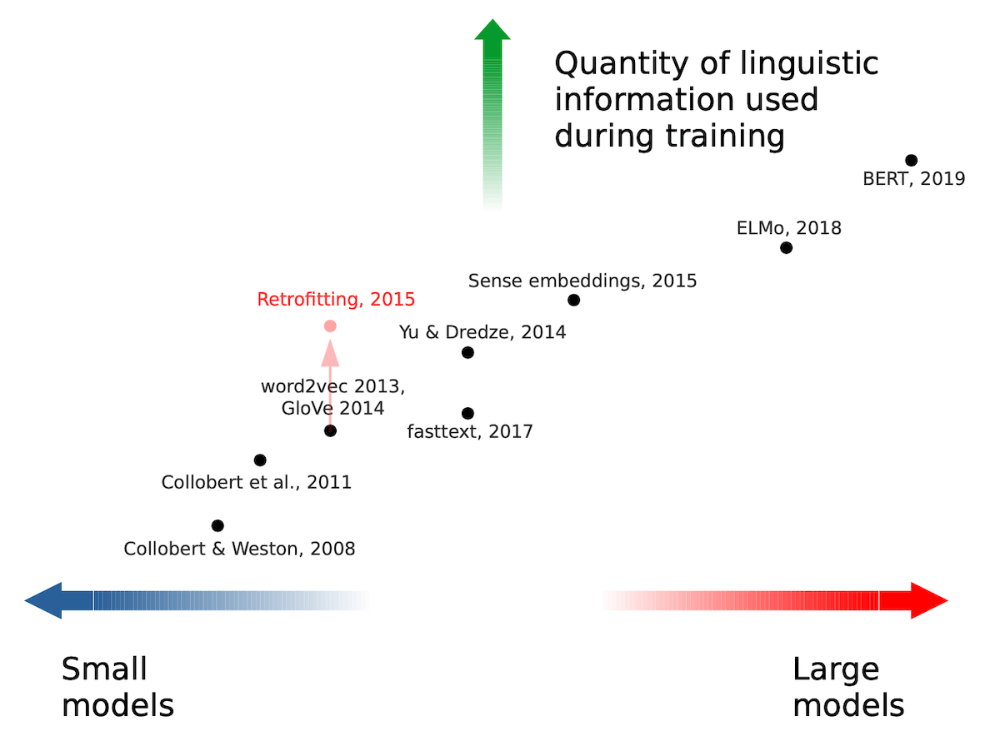
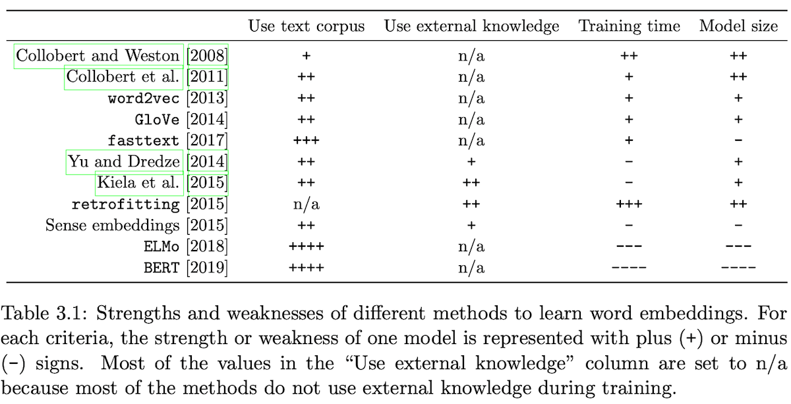
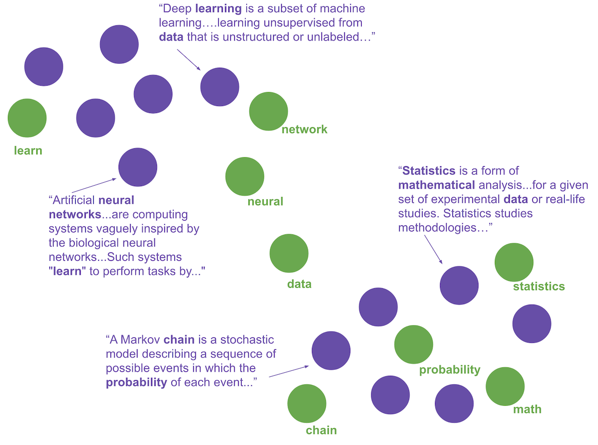
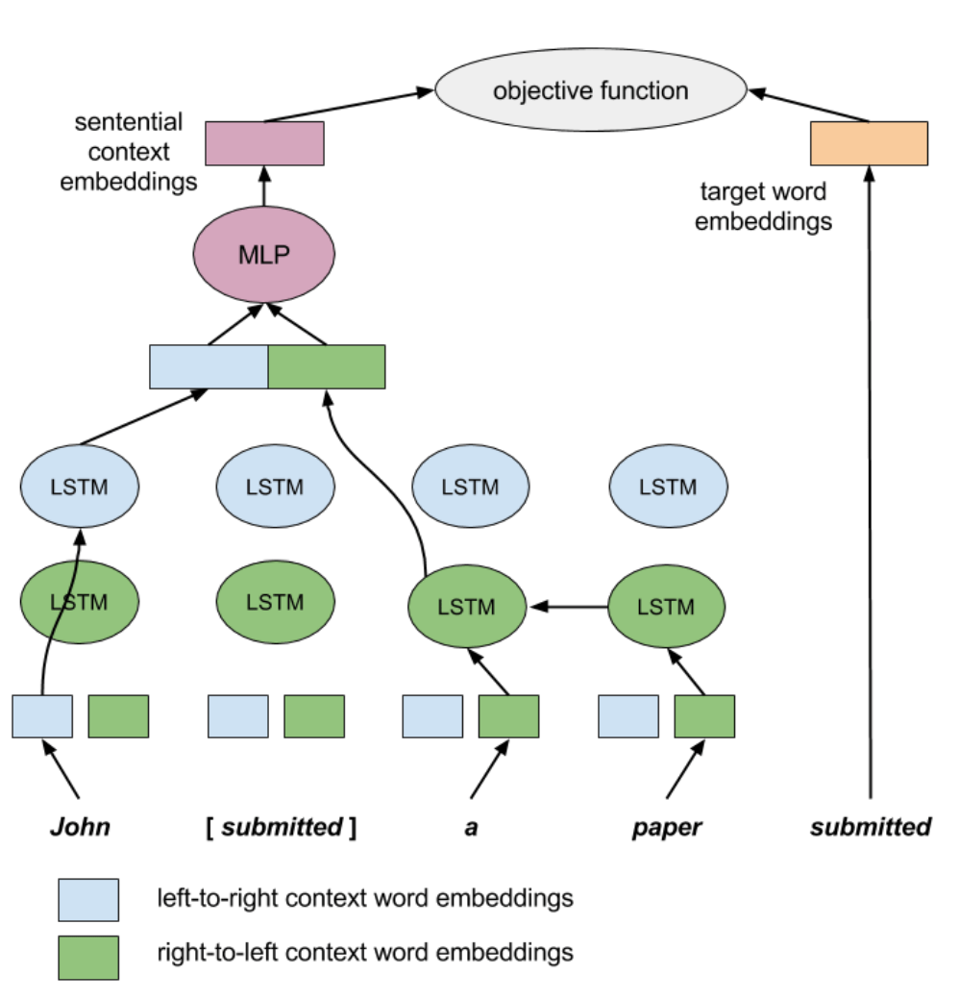

{width=600 height=450}

{width=600 height=300}

- - -

## skip-thought (sent2vec)

https://github.com/sanyam5/skip-thoughts

http://sanyam5.github.io/my-thoughts-on-skip-thoughts

## yskip

Incremental Skip-gram Model with Negative Sampling

https://github.com/yahoojapan/yskip

https://aclanthology.org/D17-1037.pdf

## wang2vec

Structured Skipngram https://github.com/wlin12/wang2vec

The two NN architectures cwindow and structured skipngram (aimed for solving syntax problems).

"Two/Too Simple Adaptations of word2vec for Syntax Problems"

## dict2vec

* https://github.com/tca19/dict2vec
* https://tel.archives-ouvertes.fr/tel-03184803/document
* https://github.com/tca19/phd-thesis/blob/main/PhD-Defense-Julien-Tissier.pdf

uses both `corpus` and `dictionary definitions` during training.

Problem:
- Words within the same window are not always related
- Semantic relations like synonymy happen rarely within the same window → not properly captured by this approach

Solution: add information contained in dictionaries.
- Strong semantic information
- Weak supervision
- Move closer related words

=> Kết quả không ấn tượng

- - - - - -

## retrofit

Paper overview of 'Retrofitting Word Vectors to Semantic Lexicons' by Manaal Faruqui et al.
https://www.youtube.com/watch?v=mws_WzJmb3s

https://github.com/mfaruqui/retrofitting/blob/master/retrofit.py

Một postprocessing để thêm thông tin từ semantic lexicons (PPDB,framenet,wordnet) vào word vectors.

## top2vec

https://github.com/ddangelov/Top2Vec

Top2Vec is an algorithm for topic modeling and semantic search. It automatically detects topics present in text and generates jointly embedded topic, document and word vectors. Once you train the Top2Vec model you can:

* Get number of detected topics.
* Get topics.
* Get topic sizes.
* Get hierarchichal topics.
* Search topics by keywords.
* Search documents by topic.
* Search documents by keywords.
* Find similar words.
* Find similar documents.

Benefits
* Automatically finds number of topics.
* No stop word lists required.
* No need for stemming/lemmatization.
* Works on short text.
* Creates jointly embedded topic, document, and word vectors.
* Has search functions built in.

- - -

The assumption the algorithm makes is that many semantically similar documents are indicative of an underlying topic. The first step is to create a joint embedding of document and word vectors. Once documents and words are embedded in a vector space the goal of the algorithm is to find dense clusters of documents, then identify which words attracted those documents together. Each dense area is a topic and the words that attracted the documents to the dense area are the topic words.

1/ Create jointly embedded document and word vectors using 
https://radimrehurek.com/gensim/models/doc2vec.html

=> Documents will be placed close to other similar documents and close to the most distinguishing words. {width=800 height=596}

2/ Create lower dimensional embedding of document vectors using 
https://github.com/lmcinnes/umap

=> Document vectors in high dimensional space are very sparse, dimension reduction helps for finding dense areas. Each point is a document vector.

3/ Find dense areas of documents using
https://github.com/scikit-learn-contrib/hdbscan

4/ For each dense area calculate the centroid of document vectors in original dimension, this is the topic vector.

. . .

## doc2vec

https://radimrehurek.com/gensim/models/doc2vec.html

Distributed Representations of Sentences and Documents
https://arxiv.org/pdf/1405.4053v2.pdf

. . .

## fastText

https://paperswithcode.com/method/fasttext

fastText embeddings exploit subword information to construct word embeddings. Representations are learnt of character -grams, and words represented as the sum of the n-gram vectors. This extends the word2vec type models with subword information. This helps the embeddings understand suffixes and prefixes. Once a word is represented using character n-grams, a skipgram model is trained to learn the embeddings.

## context2vec

https://paperswithcode.com/method/context2vec

context2vec is an unsupervised model for learning generic context embedding of wide sentential contexts, using a bidirectional LSTM. A large plain text corpora is trained on to learn a neural model that embeds entire sentential contexts and target words in the same low-dimensional space, which is optimized to reflect inter-dependencies between targets and their entire sentential context as a whole.

{width=600 height=610}